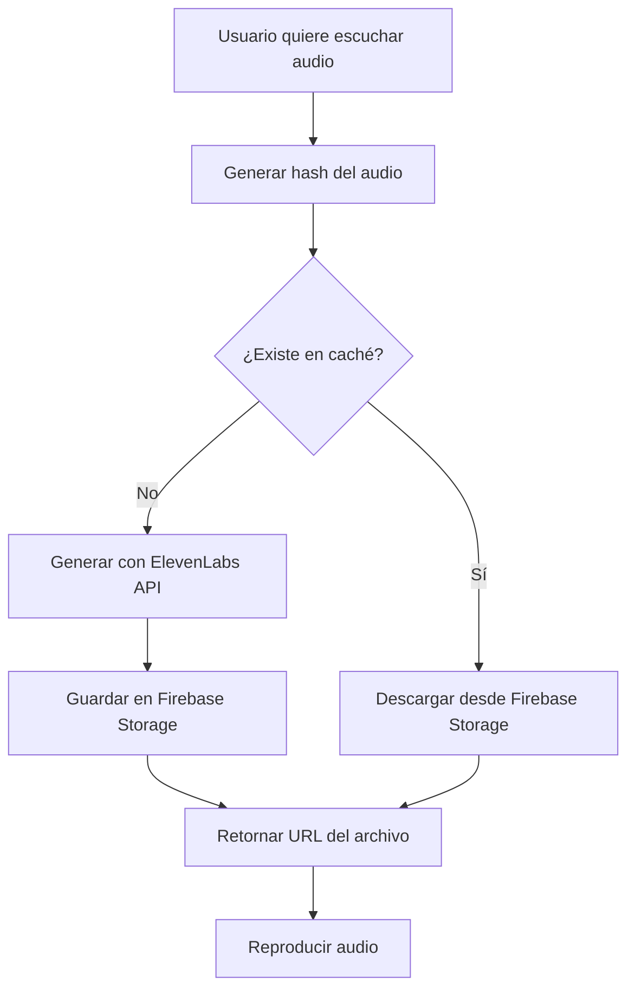

# Sistema de Caché de Audios TTS

## 📋 Resumen

Sistema de caché inteligente para audios generados por Text-to-Speech (TTS) que reduce costos de API y mejora la experiencia del usuario.

### Beneficios
- ✅ **Ahorro de costos**: Reduce llamadas a ElevenLabs API en ~99% para contenido repetido
- ✅ **Mejor rendimiento**: Reproducción instantánea (~500ms) vs generación (~2-5s)
- ✅ **Experiencia mejorada**: Sin esperas en revisitas de contenido
- ✅ **Escalable**: Funciona con Firebase Storage CDN

---

## 🏗️ Arquitectura

### Componentes Principales

```
┌─────────────────────────────────────────────────┐
│  AudioPlayer / FullDialoguePlayer              │
│  (UI Components)                                │
└─────────────────┬───────────────────────────────┘
                  │
                  ▼
┌─────────────────────────────────────────────────┐
│  audioCache.js                                  │
│  - getOrGenerateAudio()                         │
│  - preGenerateAudio()                           │
│  - clearCache()                                 │
│  - getCacheStats()                              │
└─────────────────┬───────────────────────────────┘
                  │
        ┌─────────┴──────────┐
        ▼                    ▼
┌───────────────┐   ┌────────────────────┐
│  audioHash.js │   │  Firebase Storage  │
│  (SHA-256)    │   │  /audio-cache/     │
└───────────────┘   └────────────────────┘
```

### Flujo de Funcionamiento



---

## 🔧 Implementación Técnica

### 1. Generación de Hash

El hash identifica de forma única cada audio basándose en:

```javascript
{
  text: "texto normalizado (lowercase, sin espacios extra)",
  provider: "elevenlabs" | "browser",
  voiceId: "EXAVITQu4vr4xnSDxMaL",
  rate: "1.00" // Velocidad redondeada a 2 decimales
}
```

**NO se incluye en el hash:**
- `volume`: No afecta el archivo generado, solo la reproducción
- `pitch`: No es un parámetro expuesto en ElevenLabs

**Algoritmo:** SHA-256 (prácticamente libre de colisiones)

### 2. Estructura de Almacenamiento

```
Firebase Storage:
  /audio-cache/
    /interactive-book/
      /{hash}.mp3
    /dialogue/
      /{hash}.mp3
    /exercise/
      /{hash}.mp3
    /{courseId}/
      /{hash}.mp3
```

### 3. Metadata de Archivos

Cada archivo guardado incluye metadata:

```javascript
{
  contentType: 'audio/mpeg',
  cacheControl: 'public, max-age=31536000', // Cache 1 año en CDN
  customMetadata: {
    text: "primeros 200 caracteres...",
    textLength: "150",
    provider: "elevenlabs",
    voiceId: "EXAVITQu4vr4xnSDxMaL",
    rate: "1.0",
    context: "interactive-book",
    generatedAt: "2025-01-15T10:30:00.000Z",
    hash: "abc123..."
  }
}
```

---

## 💻 Uso en Componentes

### AudioPlayer.jsx

```javascript
import audioCacheService from '../../services/audioCache';

// En la función playTTS:
const result = await audioCacheService.getOrGenerateAudio(
  text,                    // Texto del audio
  effectiveVoiceConfig,    // Configuración de voz
  'interactive-book',      // Contexto para organización
  async () => {            // Función de generación (solo si no existe)
    return await premiumTTSService.generateWithElevenLabs(
      text,
      effectiveVoiceConfig.voiceId
    );
  }
);

// result.cached = true si vino del caché
// result.audioUrl = URL permanente de Firebase Storage
```

### Indicadores Visuales

El AudioPlayer muestra badges para indicar:
- 🟢 **"Caché"**: Audio servido desde caché (verde)
- 🟠 **"Generando..."**: Generando nuevo audio (naranja, animado)

---

## 📊 Estadísticas y Monitoreo

### Obtener Estadísticas

```javascript
import audioCacheService from './services/audioCache';

// Estadísticas de un contexto específico
const stats = await audioCacheService.getCacheStats('interactive-book');
console.log(stats);
// {
//   context: 'interactive-book',
//   totalFiles: 150,
//   totalSize: 12582912,
//   totalSizeFormatted: '12.00 MB',
//   sessionStats: { hits: 45, misses: 5, errors: 0 }
// }

// Hit rate de la sesión actual
const hitRate = audioCacheService.getHitRate();
console.log(`Cache hit rate: ${hitRate}%`); // "90.00%"
```

### Métricas en Consola

El servicio logea automáticamente:
- `🔍 Audio cache lookup: abc123... (provider: elevenlabs)`
- `✅ Cache HIT! abc123... (150.23 KB)`
- `⚠️ Cache MISS: abc123... - Generando nuevo audio...`
- `💾 Guardando en caché (150.23 KB)...`

---

## 🛠️ Mantenimiento

### Limpiar Caché de un Contexto

```javascript
// Eliminar todos los audios de un curso
const result = await audioCacheService.clearCache('course-123');
console.log(`Eliminados ${result.deletedCount} archivos`);

// Eliminar solo archivos antiguos (>6 meses)
const sixMonthsAgo = new Date();
sixMonthsAgo.setMonth(sixMonthsAgo.getMonth() - 6);

const result = await audioCacheService.clearCache('interactive-book', {
  olderThan: sixMonthsAgo
});
```

### Pre-generar Audios

Útil para generar audios en background al crear contenido:

```javascript
// Al crear un nuevo diálogo, pre-generar todos los audios
dialogue.lines.forEach(async (line) => {
  const voiceConfig = getCharacterVoiceConfig(line.character);

  await audioCacheService.preGenerateAudio(
    line.text,
    voiceConfig,
    `course-${courseId}`,
    async () => {
      return await premiumTTSService.generateWithElevenLabs(
        line.text,
        voiceConfig.voiceId
      );
    }
  );
});
```

### Verificar si Existe en Caché

```javascript
const exists = await audioCacheService.existsInCache(
  "Hola, ¿cómo estás?",
  { provider: 'elevenlabs', voiceId: 'abc123', rate: 1.0 },
  'interactive-book'
);

if (exists) {
  console.log('Audio ya está en caché!');
}
```

---

## 🔒 Seguridad

### Reglas de Firebase Storage

```javascript
// storage.rules
match /audio-cache/{context}/{fileName} {
  // Lectura: cualquier usuario autenticado
  allow read: if isAuthenticated();

  // Escritura: usuarios autenticados, solo archivos de audio < 1MB
  allow write: if isAuthenticated()
               && request.resource.contentType == 'audio/mpeg'
               && request.resource.size < 1 * 1024 * 1024;

  // Eliminación: usuarios autenticados
  allow delete: if isAuthenticated();
}
```

**Consideraciones:**
- Solo usuarios autenticados pueden acceder
- Solo archivos de audio (audio/mpeg)
- Límite de 1MB por archivo (suficiente para ~60 segundos de audio)
- No hay verificación de ownership (cualquier usuario puede leer/escribir)

---

## 💰 Costos y Límites

### Firebase Storage

**Plan Gratuito (Spark):**
- 5 GB de almacenamiento
- 1 GB/día de transferencia de descarga

**Estimaciones:**
- 1 audio promedio: ~150 KB
- 5 GB = ~33,000 audios
- Suficiente para 100+ cursos completos

**Plan Blaze (Pago):**
- $0.026/GB/mes de almacenamiento
- $0.12/GB de transferencia

**Ejemplo de costos:**
- 1,000 audios (~150 MB): **$0.004/mes** de almacenamiento
- 10,000 reproducciones/mes (1.5 GB): **$0.18/mes** de transferencia

### ElevenLabs API

**Sin caché:**
- 100 estudiantes × 20 diálogos × 10 líneas = **20,000 llamadas**
- Costo: Depende del plan de ElevenLabs

**Con caché:**
- Primera generación: 20 diálogos × 10 líneas = **200 llamadas**
- Resto: 0 llamadas (servido desde caché)
- **Ahorro: 99%**

---

## ⚙️ Configuración Avanzada

### Cambiar el Path Base del Caché

```javascript
// src/services/audioCache.js
constructor() {
  this.cacheBasePath = 'audio-cache-v2'; // Cambiar aquí
}
```

### Ajustar TTL del CDN

```javascript
// En audioCache.js - uploadMetadata
cacheControl: 'public, max-age=2592000' // 30 días en lugar de 1 año
```

### Modificar Límite de Tamaño

```javascript
// storage.rules
allow write: if isAuthenticated()
             && request.resource.contentType == 'audio/mpeg'
             && request.resource.size < 2 * 1024 * 1024; // 2MB
```

---

## 🐛 Troubleshooting

### "Error: storage/unauthorized"

**Problema:** Usuario no tiene permisos para acceder al Storage

**Solución:**
```bash
# Desplegar reglas de Storage actualizadas
firebase deploy --only storage
```

### "Audio no se cachea"

**Diagnóstico:**
```javascript
// Activar logs detallados
const result = await audioCacheService.getOrGenerateAudio(...);
console.log('Cached:', result.cached);
console.log('Hash:', result.hash);
```

**Posibles causas:**
- Error al subir a Storage (permisos, tamaño)
- Blob no se descargó correctamente
- Red intermitente

### "Cache miss constante para el mismo audio"

**Problema:** El hash cambia cada vez

**Solución:**
- Verificar que el texto esté normalizado igual
- Verificar que voiceConfig tenga los mismos valores
- Revisar que rate esté redondeado a 2 decimales

---

## 📈 Próximas Mejoras

### Fase 1 (Actual) ✅
- [x] Caché básico con hash
- [x] Integración en AudioPlayer
- [x] Integración en FullDialoguePlayer
- [x] Indicadores visuales

### Fase 2 (Planificado)
- [ ] Dashboard de gestión de caché
- [ ] Pre-generación automática al crear contenido
- [ ] Limpieza automática de audios antiguos (cron job)
- [ ] Analytics de uso de caché

### Fase 3 (Futuro)
- [ ] Compresión de audios (MP3 → Opus)
- [ ] CDN externo (Cloudflare)
- [ ] Caché en IndexedDB para offline
- [ ] Versionado de voces (regenerar si voz cambia)

---

## 📚 Referencias

- [ElevenLabs - Caching Best Practices](https://elevenlabs.io/docs/cookbooks/text-to-speech/streaming-and-caching-with-supabase)
- [Firebase Storage - Best Practices](https://firebase.google.com/docs/storage/web/best-practices)
- [Web Crypto API - SHA-256](https://developer.mozilla.org/en-US/docs/Web/API/SubtleCrypto/digest)

---

## 🤝 Contribuir

Si encuentras bugs o tienes ideas de mejora:

1. Revisar logs en consola del navegador
2. Verificar estadísticas con `audioCacheService.getCacheStats()`
3. Documentar el problema con ejemplos
4. Proponer solución o abrir issue

---

**Última actualización:** 2025-01-15
**Versión:** 1.0.0
**Autor:** Sistema de Caché de Audio XIWENAPP
