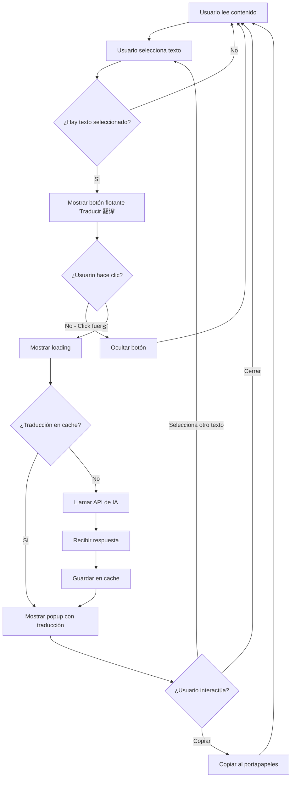
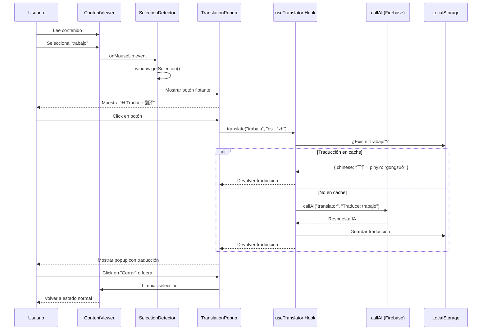

# 🎨 Diagrama Visual: Traductor con Popup

## 📱 Flujo de Interfaz de Usuario

### Paso 1: Estado inicial - Contenido normal
```
┌─────────────────────────────────────────────┐
│  📖 Contenido de la Clase                   │
├─────────────────────────────────────────────┤
│                                             │
│  Juan: Buenos días, ¿cómo estás?          │
│                                             │
│  María: Estoy bien, gracias. ¿Y tú?       │
│                                             │
│  Juan: También estoy bien. ¿Qué tal       │
│  el trabajo?                               │
│                                             │
│        ↑ Usuario lee el contenido          │
└─────────────────────────────────────────────┘
```

---

### Paso 2: Usuario selecciona una palabra/frase
```
┌─────────────────────────────────────────────┐
│  📖 Contenido de la Clase                   │
├─────────────────────────────────────────────┤
│                                             │
│  Juan: Buenos días, ¿cómo estás?          │
│                                             │
│  María: Estoy bien, gracias. ¿Y tú?       │
│                                             │
│  Juan: También estoy bien. ¿Qué tal       │
│  el ⟪trabajo⟫?                             │
│      ▔▔▔▔▔▔▔                               │
│      └─ Usuario seleccionó esta palabra    │
│                                             │
└─────────────────────────────────────────────┘
```

---

### Paso 3: Aparece botón flotante "Traducir"
```
┌─────────────────────────────────────────────┐
│  📖 Contenido de la Clase                   │
├─────────────────────────────────────────────┤
│                                             │
│  Juan: Buenos días, ¿cómo estás?          │
│                                             │
│  María: Estoy bien, gracias. ¿Y tú?       │
│                       ┌──────────────┐     │
│  Juan: También estoy  │ 🌐 Traducir  │     │
│  el ⟪trabajo⟫?         │     翻译      │     │
│      ▔▔▔▔▔▔▔          └──────────────┘     │
│                             ↑               │
│                    Botón flotante aparece   │
│                    cerca de la selección    │
└─────────────────────────────────────────────┘
```

---

### Paso 4: Usuario hace clic en "Traducir"
```
┌─────────────────────────────────────────────┐
│  📖 Contenido de la Clase                   │
├─────────────────────────────────────────────┤
│                                             │
│  Juan: Buenos días, ¿cómo estás?          │
│                                             │
│  María: Estoy bien, gracias. ¿Y tú?       │
│                       ┌──────────────┐     │
│  Juan: También estoy  │ 🌐 Traducir  │◄─┐  │
│  el ⟪trabajo⟫?         │     翻译      │  │  │
│      ▔▔▔▔▔▔▔          └──────────────┘  │  │
│                                          │  │
│                             Usuario hace clic│
│                                             │
│         ⌛ Traduciendo...                   │
└─────────────────────────────────────────────┘
```

---

### Paso 5: Popup con traducción aparece
```
┌─────────────────────────────────────────────┐
│  📖 Contenido de la Clase                   │
├─────────────────────────────────────────────┤
│                                             │
│  Juan: Buenos días, ¿cómo estás?          │
│  ┌──────────────────────────────────┐      │
│  │ 📝 Traducción                    │      │
│  ├──────────────────────────────────┤      │
│  │ trabajo → 工作 (gōngzuò)         │      │
│  │                                  │      │
│  │ 💡 Significados:                 │      │
│  │  • Trabajo, empleo               │      │
│  │  • Labor, tarea                  │      │
│  │                                  │      │
│  │ 📌 Ejemplo:                      │      │
│  │  "Voy al trabajo" = 我去上班      │      │
│  │                                  │      │
│  │        [❌ Cerrar]  [📋 Copiar]   │      │
│  └──────────────────────────────────┘      │
│  María: Estoy bien, gracias. ¿Y tú?       │
│                                             │
│  Juan: También estoy bien. ¿Qué tal       │
│  el trabajo?                               │
└─────────────────────────────────────────────┘
```

---

## 🔄 Diagrama de Flujo Técnico



---

## ⚙️ Diagrama de Secuencia (Componentes)



---

## 🎨 Mockup Visual Detallado

### Vista del Popup de Traducción (Diseño Final)

```
╔═══════════════════════════════════════════════╗
║                                               ║
║  Juan: También estoy bien. ¿Qué tal         ║
║  el ⟪trabajo⟫?                               ║
║      ▔▔▔▔▔▔▔                                 ║
║       │                                       ║
║       └─────┐                                ║
║             ↓                                 ║
║    ┏━━━━━━━━━━━━━━━━━━━━━━━━━━━━━━━┓         ║
║    ┃ 🌐 Traducción                 ┃         ║
║    ┣━━━━━━━━━━━━━━━━━━━━━━━━━━━━━━━┫         ║
║    ┃                                ┃         ║
║    ┃ 📌 trabajo                     ┃         ║
║    ┃                                ┃         ║
║    ┃ 🇨🇳 工作                        ┃         ║
║    ┃    gōngzuò                     ┃         ║
║    ┃                                ┃         ║
║    ┃ ━━━━━━━━━━━━━━━━━━━━━━━━━━━━  ┃         ║
║    ┃                                ┃         ║
║    ┃ 💡 Significados:               ┃         ║
║    ┃  • Trabajo, empleo             ┃         ║
║    ┃  • Labor, tarea                ┃         ║
║    ┃  • Obra, pieza                 ┃         ║
║    ┃                                ┃         ║
║    ┃ 📝 Ejemplo:                    ┃         ║
║    ┃  ES: "Voy al trabajo"          ┃         ║
║    ┃  中文: 我去上班                  ┃         ║
║    ┃                                ┃         ║
║    ┃ ━━━━━━━━━━━━━━━━━━━━━━━━━━━━  ┃         ║
║    ┃                                ┃         ║
║    ┃   [❌ Cerrar]    [📋 Copiar]   ┃         ║
║    ┃                                ┃         ║
║    ┗━━━━━━━━━━━━━━━━━━━━━━━━━━━━━━━┛         ║
║                                               ║
║  María: Muy bien también.                    ║
║                                               ║
╚═══════════════════════════════════════════════╝
```

---

## 🚀 Estados del Sistema

### Estado 1: Normal
- Contenido visible
- Sin selección
- Sin botones extras

### Estado 2: Texto seleccionado
- Texto resaltado
- Botón flotante "Traducir 翻译" visible
- Posicionado cerca de la selección

### Estado 3: Traduciendo
- Botón muestra "⌛ Traduciendo..."
- Deshabilitado durante carga
- Duración: ~1-2 segundos

### Estado 4: Traducción mostrada
- Popup visible con traducción
- Opciones: Cerrar, Copiar
- Auto-cierra si se selecciona otro texto

---

## 📊 Datos del Popup

```javascript
{
  word: "trabajo",              // Palabra original
  chinese: "工作",              // Traducción al chino
  pinyin: "gōngzuò",           // Pronunciación
  meanings: [                   // Significados
    "Trabajo, empleo",
    "Labor, tarea",
    "Obra, pieza"
  ],
  example: {                    // Ejemplo de uso
    spanish: "Voy al trabajo",
    chinese: "我去上班"
  },
  cached: true                  // Si vino del cache
}
```

---

## 🎯 Ventajas de este diseño

✅ **No interrumpe la lectura**: El popup es pequeño y no tapa mucho contenido
✅ **Rápido**: Cache local evita llamadas repetidas a la IA
✅ **Contextual**: Aparece solo cuando el usuario lo necesita
✅ **Educativo**: No solo traduce, da contexto y ejemplos
✅ **Accesible**: Se puede cerrar con ESC o clic fuera
✅ **Móvil-friendly**: Funciona en táctil (long-press para seleccionar)

---

## 📁 Archivos a crear

1. `src/components/translation/TranslationPopup.jsx` - Componente del popup
2. `src/components/translation/SelectionDetector.jsx` - Detecta selección de texto
3. `src/hooks/useTranslator.js` - Hook para traducir con cache
4. `src/utils/translationCache.js` - Sistema de cache local

## 🔧 Archivos a modificar

1. `src/components/ContentViewer.jsx` - Agregar SelectionDetector
2. `src/components/InteractiveBookViewer.jsx` - Agregar SelectionDetector
3. `src/components/interactive-book/DialogueBubble.jsx` - Agregar SelectionDetector
4. `src/constants/aiFunctions.js` - Habilitar función translator

---

¿Te queda más claro ahora? 😊
